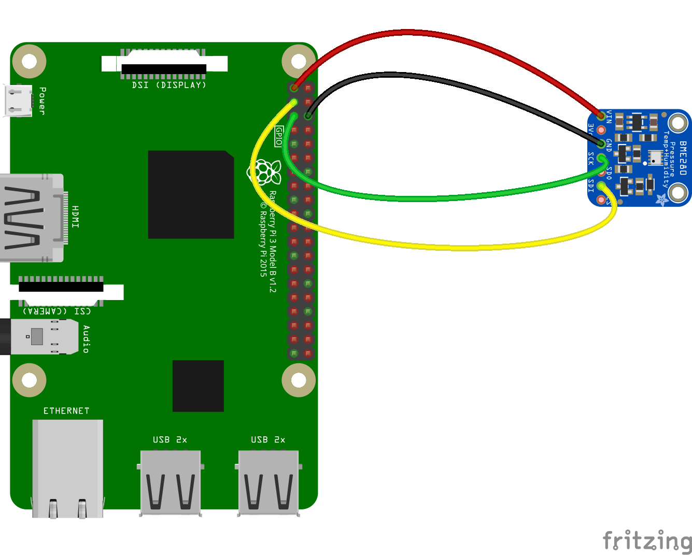

[](https://travis-ci.org/fivdi/bme280)
[](https://www.npmjs.com/package/bme280)
[](https://www.npmjs.com/package/bme280)

# bme280

Node.js I2C driver for the BME280 humidity, pressure and temperature sensor on
Linux boards like the Raspberry Pi or BeagleBone.

Supports Node.js versions 8, 10, 12, 13 and 14.

## Contents

 * [Features](#features)
 * [Installation](#installation)
 * [Usage](#usage)
 * [API](#api)
 * [Related Packages](#related-packages)

## Features

 * Easy humidity, pressure and temperature sensing
 * Normal and forced mode
 * Oversampling
 * Filtering
 * Standby period
 * Promise based asynchronous API

## Installation

```
npm install bme280
```

## Usage

#### Circuit



#### Report the Humidity, Pressure and Temperature
```js
const bme280 = require('bme280');

bme280.open().then(async sensor => {
  console.log(await sensor.read());
  await sensor.close();
}).catch(console.log);

```

Sample output:
```js
{
  temperature: 22.80022401222959,
  pressure: 990.4595757059205,
  humidity: 51.50271664115457
}
```

#### Report the Humidity, Pressure and Temperature Once per Second in Forced Mode
```js
const bme280 = require('bme280');

const delay = millis => new Promise(resolve => setTimeout(resolve, millis));

const forcedRead = async sensor => {
  await sensor.triggerForcedMeasurement();
  await delay(sensor.maximumMeasurementTime());
  console.log(await sensor.read());
}

bme280.open({forcedMode: true}).then(sensor => {
  setInterval(_ => {
    forcedRead(sensor).catch(console.log);
  }, 1000);
}).catch(console.log);
```

#### Configure the BME280 Using Options When Invoking `open`
Here the BME280 is configured to run using oversampling and filtering
options recommended for indoor navigation by the BME280 datasheet.

```js
const bme280 = require('bme280');

const format = number => (Math.round(number * 100) / 100).toFixed(2);
const delay = millis => new Promise(resolve => setTimeout(resolve, millis));

const reportContinuous = async _ => {
  const sensor = await bme280.open({
    i2cBusNumber: 1,
    i2cAddress: 0x77,
    humidityOversampling: bme280.OVERSAMPLE.X1,
    pressureOversampling: bme280.OVERSAMPLE.X16,
    temperatureOversampling: bme280.OVERSAMPLE.X2,
    filterCoefficient: bme280.FILTER.F16
  });

  for (let i = 1; i <= 250; ++i) {
    const reading = await sensor.read();
    console.log(
      `${i} ` +
      `${format(reading.temperature)}°C, ` +
      `${format(reading.pressure)} hPa, ` +
      `${format(reading.humidity)}%`
    );
    await delay(sensor.typicalMeasurementTime()); // 40 milliseconds, 25Hz
  }

  await sensor.close();
};

reportContinuous().catch(console.log);
```

Sample output:
```
1 23.57°C, 988.07 hPa, 50.16%
2 23.57°C, 988.07 hPa, 50.15%
3 23.57°C, 988.07 hPa, 50.19%
4 23.57°C, 988.07 hPa, 50.17%
5 23.57°C, 988.06 hPa, 50.19%
6 23.57°C, 988.06 hPa, 50.17%
...
```
## API

- [Functions](#functions)
- [Class Bme280](#class-bme280)
- [Enum OVERSAMPLE](#enum-oversample)
- [Enum FILTER](#enum-filter)
- [Enum STANDBY](#enum-standby)

### Functions

- [open([options])](#openoptions)

#### open([options])
Returns a Promise that will be resolved with a Bme280 object on success, or
will be rejected if an error occurs.

The default behavior of open is to configure the BME280 on I2C bus 1 at
address 0x77 to run in normal mode. The oversampling defaults for humidity,
pressure and temperature are OVERSAMPLE.X1 and the default filterCoefficient
is FILTER.OFF. The default standby period in normal mode is STANDBY.MS_0_5 for
0.5 milliseconds. Options are available for overriding these defaults.

If desired, the BME280 can be configured to run in forced mode rather than in
normal mode by setting option forcedMode to true.

Normal mode comprises an automated perpetual cycling between an active
measurement period and an inactive standby period. If the BME280 is configured
to run in normal mode, open waits (asynchronously) until the BME280 has
completed its first measurement before resolving. This makes it possible to
invoke the read method immediately after invoking open to get the first
reading.

In forced mode each measurement must be explicitly triggered. If the BME280 is
configured to run forced mode, open will not trigger a measurement. It is the
responsibility of the application to trigger each measurement and to wait for
the measurement to complete before invoking read to get the reading.

The following options are supported:
- i2cBusNumber - integer, I2C bus number, optional, default 1
- i2cAddress - integer, BME280 I2C address, optional, default 0x77
- humidityOversampling - one of the [OVERSAMPLE](#enum-oversample) enum
values, controls oversampling of humidity data, optional, default
OVERSAMPLE.X1
- pressureOversampling - one of the [OVERSAMPLE](#enum-oversample) enum
values, controls oversampling of pressure data, optional, default
OVERSAMPLE.X1
- temperatureOversampling - one of the [OVERSAMPLE](#enum-oversample) enum
values, controls oversampling of temperature data, optional, default
OVERSAMPLE.X1
- filterCoefficient - one of the [FILTER](#enum-filter) enum values, slows
down the response to the sensor inputs, optional, default FILTER.OFF
- standby - one of the [STANDBY](#enum-standby) enum values, controls the
inactive standby period in normal mode, optional, default STANDBY.MS_0_5 for
0.5 milliseconds
- forcedMode - boolean, true to run the BME280 in forced mode, false to run
the BME280 in normal mode, optional, default false

### Class Bme280

- [read()](#read)
- [triggerForcedMeasurement()](#triggerForcedMeasurement)
- [typicalMeasurementTime()](#typicalmeasurementtime)
- [maximumMeasurementTime()](#maximummeasurementtime)
- [close()](#close)

#### read()
Returns a Promise that will be resolved with an object containing the last
sensor reading on success, or will be rejected if an error occurs.

An object containing a sensor reading has the following properties:
- humidity - number, relative humidity in percent
- pressure - number, pressure in hectopascal (1 hPa = 1 millibar)
- temperature - number, temperature in degrees Celsius

#### triggerForcedMeasurement()
Returns a Promise that will be resolved with no arguments once the BME280 has
been triggered to perform a forced measurement, or will be rejected if an
error occurs.

triggerForcedMeasurement should only be called in forced mode.

Calling triggerForcedMeasurement will only trigger the BME280 to perform a
forced measurement. It will not wait for that measurement to complete. It is
the responsibility of the application to wait for the measurement to complete
before invoking read to get the reading.

#### typicalMeasurementTime()
Returns the typical measurement time in milliseconds.

The typical measurement time depends on the selected values for humidity,
pressure and temperature oversampling.

If OVERSAMPLE.X1 (the default) is used for humidity, pressure and temperature
oversampling, the typical measurement time is 8 milliseconds.

If OVERSAMPLE.X16 is used for humidity, pressure and temperature oversampling,
the typical measurement time is 98 milliseconds.

#### maximumMeasurementTime()
Returns the maximum measurement time in milliseconds.

The maximum measurement time depends on the selected values for humidity,
pressure and temperature oversampling.

If OVERSAMPLE.X1 (the default) is used for humidity, pressure and temperature
oversampling, the maximum measurement time is 10 milliseconds.

If OVERSAMPLE.X16 is used for humidity, pressure and temperature oversampling,
the maximum measurement time is 113 milliseconds.

#### close()
Returns a Promise that will be resolved with no arguments once the underlying
resources have been released, or will be rejected if an error occurs while
closing.

### Enum OVERSAMPLE

Controls oversampling of sensor data.

- **SKIPPED** - Measurement skipped. The corresponding property in a sensor
reading object will be undefined.
- **X1** - Oversampling × 1
- **X2** - Oversampling × 2
- **X4** - Oversampling × 4
- **X8** - Oversampling × 8
- **X16** - Oversampling × 16

### Enum FILTER

The filter is used to slow down the response to the sensor inputs.

- **OFF** - Filter off
- **F2** - Filter coefficient = 2
- **F4** - Filter coefficient = 4
- **F8** - Filter coefficient = 8
- **F16** - Filter coefficient = 16

### Enum STANDBY

Controls the inactive standby period in normal mode.

- **MS_0_5** - 0.5 milliseconds
- **MS_62_5** - 62.5 milliseconds
- **MS_125** - 125 milliseconds
- **MS_250** - 250 milliseconds
- **MS_500** - 500 milliseconds
- **MS_1000** - 1000 milliseconds
- **MS_10** - 10 milliseconds
- **MS_20** - 20 milliseconds

## Related Packages

- [i2c-bus](https://github.com/fivdi/i2c-bus) - I2C serial bus access

